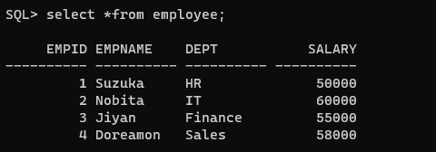

# Ex. No: 4 Creating Procedures using PL/SQL

### DATE: 
### AIM: To create a procedure using PL/SQL.

### Steps:
1. Create employee table with following attributes (empid NUMBER, empname VARCHAR(10), dept VARCHAR(10),salary NUMBER);
2. Create a procedure named as insert_employee data.
3. Inside the procdure block, write the query for inserting the values into the employee table.
4. End the procedure.
5. Call the insert_employee data procedure to insert the values into the employee table.
6. Display the employee table

### Program:
```sql
CREATE TABLE employee (empid NUMBER, empname VARCHAR2(10), dept VARCHAR2(10), salary NUMBER);

CREATE OR REPLACE PROCEDURE insert_employee_data(
  p_empid IN NUMBER,
  p_empname IN VARCHAR2,
  p_dept IN VARCHAR2,
  p_salary IN NUMBER
) AS
BEGIN
  INSERT INTO employee (empid, empname, dept, salary)
  VALUES (p_empid, p_empname, p_dept, p_salary);
  
  COMMIT;
END;
/
```
```sql
BEGIN
  insert_employee_data(1, 'Suzuka', 'HR', 50000);
  insert_employee_data(2, 'Nobita', 'IT', 60000);
  insert_employee_data(3, 'Jiyan', 'Finance', 55000);
  insert_employee_data(4, 'Doreamon', 'Sales', 58000);
  COMMIT;
END;
/

 select *from employee;
```
### Output:




```
SUBMITTED BY :
NAME : SATHISH R
REGNO: 212222100048
```

### Result:
Therefore, the procedure is created , the values are inserted and displayed using PL/SQL Successfully.
